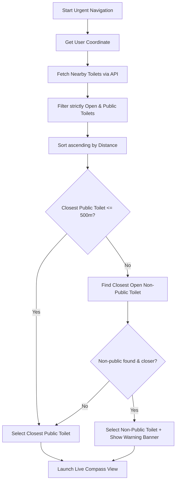

# WC-Info Web App Rebuild Specification & Architecture Guide

> **Document Purpose**: This comprehensive specification is designed for an AI agent (or development team) tasked with rebuilding the **WC-Info** native iOS app as a responsive, modern **Web Application**. It provides complete end-to-end specifications: product requirements, architecture, screen-by-screen UX workflows, data models, API endpoints, business logic algorithms, and visual references.

---

## Table of Contents

1. [Executive Summary & Product Overview](#1-executive-summary--product-overview)
2. [Recommended Web Architecture & Tech Stack](#2-recommended-web-architecture--tech-stack)
3. [Responsive Layout & Visual Design System](#3-responsive-layout--visual-design-system)
4. [Data Models & TypeScript Interfaces](#4-data-models--typescript-interfaces)
5. [Backend API Reference & Networking Layer](#5-backend-api-reference--networking-layer)
6. [Core Business Logic & Algorithms](#6-core-business-logic--algorithms)
7. [Screen-by-Screen Specifications & Component Hierarchy](#7-screen-by-screen-specifications--component-hierarchy)
8. [Simulator Screenshots & Visual References](#8-simulator-screenshots--visual-references)
9. [Step-by-Step Implementation Roadmap for the Web Agent](#9-step-by-step-implementation-roadmap-for-the-web-agent)

---

## 1. Executive Summary & Product Overview

### 1.1 Mission
**WC-Info** is a community-driven and open data platform dedicated to helping people quickly find clean, accessible, and suitable public restroom facilities.

### 1.2 Core Features
- **Location-Based Search & Autocomplete**: Search by current GPS position or any address/place worldwide with Google Places autocomplete.
- **Dynamic Viewport Loading**: Automatically loads restrooms within the map's bounding box as the user pans and zooms.
- **Rich Attribute Filtering**:
  - Open right now vs. closed
  - Publicly accessible vs. customer-only / non-public (with clear disclaimers)
  - Wheelchair accessible / barrier-free
  - Euro-key (*Euroschlüssel*) compatible
  - Baby changing table (*Wickeltisch*)
  - Gender-separated vs. Unisex
- **Live Status & Opening Hours**: Calculates real-time open/closed status, countdowns (e.g. *"schließt in 25 Min."*), 24/7 detection, and weekly schedule breakdowns.
- **Emergency / Urgent Navigation (*Notfall-Navigation*)**:
  - Instant one-tap navigation to the nearest open public toilet.
  - Smart Fallback: If no public toilet is within 500 meters, automatically finds the closest open non-public toilet (e.g. café, station).
  - Built-in live compass navigation showing bearing, live distance in meters, and directional arrows.
- **Crowdsourced Creation Wizard (`CreateScreen`)**: 16-step conversational wizard that progressively saves baseline data at Step 6 and enriches attributes in subsequent steps.
- **Photo Upload & Legal Compliance**: EXIF GPS extraction from uploaded photos, community review legal agreements, and lightbox gallery.
- **Community Feedback & Edit Suggestions**: In-app feedback reporting and structured attribute editing with Google Places data syncing.

---

## 2. Recommended Web Architecture & Tech Stack

| Layer | Recommended Technology | Rationale |
| :--- | :--- | :--- |
| **Framework** | **Next.js 14+ (App Router)** or **React + Vite** | High performance, SEO-friendly SSR for landing pages, client-side routing. |
| **Styling** | **Tailwind CSS + Lucide React** | Matches modern responsive utility-first styling with high visual fidelity. |
| **UI Components** | **Radix UI / Shadcn UI** | Accessible modals, dialogs, dropdowns, and drawers. |
| **Mobile Drawer** | **Vaul** (or Embla Carousel) | Provides native iOS-like pull-up drawer behavior on mobile screens. |
| **Mapping Engine** | **MapLibre GL JS** / **Mapbox GL JS** or **Google Maps JavaScript API** | Smooth vector tile rendering, custom markers, bounds events, and satellite mode. |
| **State & Query** | **TanStack Query (React Query) + Zustand** | Server-state caching, automatic refetching on map camera idle, persistent filters. |
| **EXIF Parsing** | **`exifr`** | Client-side extraction of GPS coordinates and timestamp metadata from user photos. |
| **Compass / Sensors**| **DeviceOrientation API & Geolocation API** | `navigator.geolocation.watchPosition` and `window.addEventListener('deviceorientationabsolute')`. |
| **Analytics & Logs** | **Matomo Tag / Matomo Tracker & Sentry Web** | Matches the native app's Matomo and Sentry instrumentation. |

---

## 3. Responsive Layout & Visual Design System

### 3.1 Layout Modes

The web application should support two primary layout modes based on screen width:

1. **Desktop & Tablet Landscape (Split-View)** (`width >= 768px`):
   - **Left Pane (Sidebar)**: Fixed width (e.g. `420px` to `500px`) or resizable horizontal split. Contains search header, filter banner, and scrollable list of `ToiletCard` items.
   - **Right Pane (Map)**: Full-height interactive map view with custom markers, user location pulse, satellite toggle, and "+ Toilette hinzufügen" floating button.
   - **Modals / Drawers**: Detail view, Create wizard, and Edit forms render as clean center modals or side drawers.

2. **Mobile & Tablet Portrait** (`width < 768px`):
   - **Full-Screen Map Base**: The map occupies the background.
   - **Floating Search & Filter Header**: Positioned at the top with translucent backdrop blur.
   - **Interactive Bottom Sheet / Drawer**:
     - *Collapsed (peek)*: Shows top 1-2 nearest toilets with drag handle.
     - *Half-expanded*: Shows scrollable list of toilets.
     - *Full-screen*: Displays selected toilet detail view or creation wizard.
   - **Floating Action Buttons (FAB)**: Locate me, Satellite toggle, and Urgent navigation button.

```
+-----------------------------------------------------------------------+
| Desktop / iPad Landscape (Split Layout)                               |
+------------------------------------+----------------------------------+
| [ Search / Filters Banner        ] |                                  |
| ---------------------------------- |           Interactive            |
| [ Toilet Card 1 (Active)         ] |            Map View              |
|   - Name, Distance, Opening Hour   |                                  |
|   - [Navigieren] [Details]         |        [Pin: Selected]           |
| ---------------------------------- |     [Pin]          [Pin]         |
| [ Toilet Card 2                  ] |                                  |
| [ Toilet Card 3                  ] |                                  |
| [ Toilet Card 4                  ] | [🛰️ Satellite]   [📍 Locate]   |
+------------------------------------+----------------------------------+

+-------------------------------------+
| Mobile / iPhone Portrait Layout     |
+-------------------------------------+
| [ 🔍 Search & Filter Bar          ] |
|                                     |
|                                     |
|             Map Area                |
|         (with toilet pins)          |
|                                     |
| [ 🛰️ ]                     [ 📍 ]  |
+-------------------------------------+
| ═══════════════════════════════════ |  <-- Draggable Bottom Sheet
| [ WC am Hauptbahnhof       45 m ]   |
| [ Jetzt geöffnet • Rollstuhlgerecht ]|
| [ [🧭 Navigieren]    [Details >]  ] |
+-------------------------------------+
```

### 3.2 Color Palette & Design Tokens

```css
:root {
  --primary-purple: #9333ea;       /* Primary brand, active states, active filters */
  --primary-purple-hover: #7e22ce;
  --primary-purple-light: #f3e8ff; /* 10-15% opacity background fills */
  
  --status-open: #22c55e;          /* "Jetzt geöffnet", success checkmarks */
  --status-urgent-close: #ef4444;  /* "schließt in < 30 Min" */
  --status-warning: #f97316;       /* "Temporary closed", non-public notice */
  --status-closed: #6b7280;        /* "Geschlossen" */
  
  --bg-app: #f9fafb;
  --bg-card: #ffffff;
  --bg-secondary: #f3f4f6;
  --border-subtle: #e5e7eb;
}
```

---

## 4. Data Models & TypeScript Interfaces

```typescript
// ==========================================
// Toilet Core Model
// ==========================================

export interface GooglePlacesPoint {
  day: number;      // 0 = Sunday, 1 = Monday, ..., 6 = Saturday
  hour: number;     // 0 - 23
  minute: number;   // 0 - 59
}

export interface GooglePlacesPeriod {
  open: GooglePlacesPoint;
  close?: GooglePlacesPoint | null;
}

export interface ToiletPhoto {
  id: number;
  toiletId: number;
  url: string;
  urlThumb: string;
  isMain: boolean;
  filename?: string;
}

export interface ToiletPropertyItem {
  id?: number;
  type: string;     // e.g. "storage_space", "euro_key", "operator"
  value: string;
}

export interface Toilet {
  id: number;
  name: string;
  owner: string;
  lat: number;
  lon: number;
  placeId?: string | null;
  status: 'active' | 'temporary_closed' | 'inactive';
  temporaryClosed: boolean;
  
  // Accessibility & Features
  isQualified: boolean;
  isUnisex: boolean;
  isGenderSeparated: boolean;
  hasWheelchairAccess: boolean;
  hasChangingTable: boolean;
  publicAccessible: boolean;
  accessibleOutsideOpeningTimes: boolean;
  euroKey?: string | null;            // "yes", "no", "true", "false", "1", "0"
  storageSpace?: 'none' | 'little' | 'much' | string | null;
  
  // Opening Hours
  isOpen?: boolean | null;
  openTimestamp?: string | null;      // ISO-8601 string
  closeTimestamp?: string | null;     // ISO-8601 string
  placeOpeningHours?: GooglePlacesPeriod[] | null;
  
  // Metadata
  address?: string | null;
  website?: string | null;
  comment?: string | null;
  distance?: number | null;           // Distance in kilometers
  photos: ToiletPhoto[];
  properties?: ToiletPropertyItem[];
  createdAt?: string;
  updatedAt?: string;
}

// ==========================================
// Filter Settings Model
// ==========================================

export interface ToiletFilterSettings {
  showClosed: boolean;
  showNonPublic: boolean;
  showNonWheelchairAccessible: boolean;
  showWithoutChangingTable: boolean;
  showWithoutGenderSeparation: boolean;
  showWithoutEuroKey: boolean;
}

export const DEFAULT_FILTER_SETTINGS: ToiletFilterSettings = {
  showClosed: false,
  showNonPublic: false,
  showNonWheelchairAccessible: true,
  showWithoutChangingTable: true,
  showWithoutGenderSeparation: true,
  showWithoutEuroKey: true,
};

// ==========================================
// API Request Payloads
// ==========================================

export interface AddToiletPayload {
  name?: string | null;
  owner?: string | null;
  lat: number;
  lon: number;
  placeId?: string | null;
  isUnisex?: boolean;
  isGenderSeparated?: boolean;
  hasWheelchairAccess?: boolean;
  hasChangingTable?: boolean;
  accessibleOutsideOpeningTimes?: boolean;
  publicAccessible?: boolean;
  placeOpeningHours?: GooglePlacesPeriod[] | null;
  address?: string | null;
  website?: string | null;
  comment?: string | null;
  euroKey?: string | null;
  storageSpace?: string | null;
  status?: string;
}

export interface UpdateToiletPayload extends AddToiletPayload {
  isQualified?: boolean | null;
}

export interface SendToiletFeedbackRequest {
  subject: string;
  message?: string | null;
}

export interface UploadPhotoResponse {
  success: boolean;
  toiletId: number;
  filename: string;
  imageUrl: string;
  thumbUrl: string;
}
```

---

## 5. Backend API Reference & Networking Layer

### 5.1 Base URL & Environment Config
- **Production Base URL**: `https://api2.wc-info.de`
- **Development Base URL**: `http://localhost:8000`
- **Authorization**: `Bearer <APIKey>` header sent if configured.
- **CSRF Token Handling**:
  The backend uses Laravel Sanctum / CSRF session cookies.
  - Extract the `XSRF-TOKEN` cookie value and pass it in the `X-XSRF-TOKEN` HTTP header for mutating requests (`POST`, `PATCH`, `DELETE`).
  - **419 Session Expired Handler**: If an API request responds with HTTP status `419`, execute a `GET /health` request once to establish/refresh session cookies, then automatically retry the original request.

### 5.2 Endpoints Table

| Method | Endpoint | Description | Query / Body | Response |
| :--- | :--- | :--- | :--- | :--- |
| `GET` | `/toilets/nearby/{lat}/{lon}` | Fetch nearby toilets around coordinate | `distance` (1-10 km, default: 5)<br>`filter` (filter string) | `Toilet[]` |
| `GET` | `/toilets/bounds/{south}/{west}/{north}/{east}` | Fetch toilets inside map bounding box | `filter` (filter string) | `Toilet[]` |
| `POST` | `/toilet/add` | Create a new toilet record | Body: `AddToiletPayload` (JSON) | `{"success": true, "id": 1234}` |
| `PATCH` | `/toilet/{id}/update` | Update existing toilet attributes | Body: `UpdateToiletPayload` (JSON) | `{"success": true, "id": 1234}` |
| `POST` | `/toilet/feedback/{id}` | Submit user issue/feedback | Body: `{"subject": string, "message": string}` | `{"status": "success", "message": "..."}` |
| `POST` | `/toilet/add-properties/{id}` | Batch insert custom properties | Body: `[{"type": string, "value": string}]` | `{"success": true, "count": 2}` |
| `POST` | `/upload` | Upload toilet photo with EXIF | `multipart/form-data`<br>- `file`: Binary file<br>- `toilet_id`: Int (optional)<br>- `exif`: JSON string (optional)<br>- `fixed_geo`: `{"lat": float, "lon": float}` (optional) | `UploadPhotoResponse` |
| `DELETE`| `/deletePhoto/{toiletId}/{filename}` | Delete uploaded photo | Query: `soft=0` or `soft=1` | `{"success": true}` |
| `GET` | `/health` | Health check & cookie refresh | None | `{"status": "ok"}` |

### 5.3 Filter Query String Generation

The API accepts a comma-separated key-value filter parameter: `?filter=key:val,key:val`.

```typescript
export function buildApiFilterQuery(settings: ToiletFilterSettings): string {
  const parts: string[] = [];

  if (!settings.showClosed) {
    parts.push('is_open:true');
  }
  if (!settings.showNonPublic) {
    parts.push('public_accessible:true');
  }
  if (!settings.showNonWheelchairAccessible) {
    parts.push('has_wheelchair_access:true');
  }
  if (!settings.showWithoutChangingTable) {
    parts.push('has_changing_table:true');
  }
  if (!settings.showWithoutGenderSeparation) {
    parts.push('is_gender_separated:true');
  }
  if (!settings.showWithoutEuroKey) {
    parts.push('euro_key:yes');
  }

  return parts.join(',');
}
```

---

## 6. Core Business Logic & Algorithms

### 6.1 Real-Time Opening Hours & 24/7 Detection

Restrooms may provide opening hours in one of two formats:
1. Direct timestamps: `openTimestamp` and `closeTimestamp` (ISO-8601 dates).
2. Google Places periods: `placeOpeningHours: GooglePlacesPeriod[]`.

#### 24/7 Opening Logic:
A toilet is considered **Open 24/7** if:
- `placeOpeningHours` has exactly 1 entry with `open.day === 0`, `open.hour === 0`, `open.minute === 0` and `close === null` OR
- `placeOpeningHours` has 7 entries (days 0 through 6) all having `open: 00:00` and `close: 24:00` (or `close: 00:00` next day).

#### Remaining Time Countdown:
- If currently open and `closeTimestamp` is within the next 24 hours:
  - If `< 30 minutes`: Display in **Red** (urgent: e.g. *"schließt in 18 Min."*).
  - Else: Display in **Secondary** (e.g. *"schließt in 2 Std. 15 Min."*).
- If currently closed and `openTimestamp` is available:
  - Display in **Purple** (e.g. *"öffnet um 08:00"* or *"öffnet in 45 Min."*).

### 6.2 Emergency Navigation & Fallback Algorithm

When emergency mode is activated (via URL `/urgent-navigate?lat=...&lon=...` or tapping the urgent action button):



### 6.3 Great-Circle Bearing & Device Compass Alignment

To calculate compass needle angles on web devices:

```typescript
// Calculate bearing from user coordinate to toilet coordinate
export function calculateBearing(
  lat1: number, lon1: number,
  lat2: number, lon2: number
): number {
  const toRad = (deg: number) => (deg * Math.PI) / 180;
  const toDeg = (rad: number) => (rad * 180) / Math.PI;

  const dLon = toRad(lon2 - lon1);
  const phi1 = toRad(lat1);
  const phi2 = toRad(lat2);

  const y = Math.sin(dLon) * Math.cos(phi2);
  const x = Math.cos(phi1) * Math.sin(phi2) - Math.sin(phi1) * Math.cos(phi2) * Math.cos(dLon);
  const radians = Math.atan2(y, x);
  return (toDeg(radians) + 360) % 360;
}

// Direction description lookup (e.g., "Geradeaus", "Halb rechts", "Rechts")
export function getDirectionDescription(relativeAngle: number, distanceMeters: number): string {
  if (distanceMeters <= 10) return "Du hast das Ziel erreicht!";
  
  const angle = (relativeAngle + 360) % 360;
  if (angle >= 345 || angle < 15) return "Geradeaus";
  if (angle >= 15 && angle < 75) return "Halb rechts";
  if (angle >= 75 && angle < 105) return "Rechts";
  if (angle >= 105 && angle < 165) return "Scharf rechts";
  if (angle >= 165 && angle < 195) return "Hinter dir";
  if (angle >= 195 && angle < 255) return "Scharf links";
  if (angle >= 255 && angle < 285) return "Links";
  return "Halb links";
}
```

---

## 7. Screen-by-Screen Specifications & Component Hierarchy

### 7.1 Screen 1: Home / Landing View (`HomeView`)
- **Visuals**: Fullscreen hero background image with dark overlay, centered WC-Info logo, and clear search container card.
- **Search Input**:
  - Live query autocomplete integrating Google Places API (or Mapbox Geocoding).
  - Dropdown displays matching places with icon, primary title, and secondary text (e.g. city/suburb).
- **Action Buttons**:
  - `Suchen` (Search): Navigates to `/search?lat=...&lon=...&name=...`.
  - `In der Nähe` (Nearby): Prompts for browser geolocation and executes instant radius search.
- **Recent Searches**: Stored in `localStorage` and shown below the input when focused.

### 7.2 Screen 2: Results & Split View (`ResultsView`)
- **Filter Banner (`FilterBannerView`)**:
  - Compact summary pill showing active criteria (e.g. *"Nur geöffnete, barrierefreie Toiletten"*).
  - Expandable accordion with switches:
    - *Geschlossene Toiletten anzeigen*
    - *Nicht-öffentliche Toiletten anzeigen* (with info alert explaining private/customer facilities)
    - *Nicht-barrierefreie Toiletten anzeigen*
    - *Toiletten ohne Wickelraum anzeigen*
    - *Toiletten ohne Geschlechtertrennung anzeigen*
    - *Toiletten ohne Euroschlüssel anzeigen* (with info modal about Euro-key)
    - *Standard Filter anwenden* (Reset button)
- **Map View (`MapView`)**:
  - Custom Marker styling:
    - **Green/Blue Pin**: Wheelchair accessible / Unisex / Gender-separated.
    - **Grayscale Pin**: Temporarily closed.
    - **Purple Selected Pin**: Currently active toilet.
  - Map Long-Press / Right-Click: Drops a temporary marker with a popup: *"Hier Toilette anlegen"* -> opens Create Wizard.
  - Viewport Debounce: On `cameraIdle` / `moveend`, extracts bounding box coordinates `[south, west, north, east]` and calls `GET /toilets/bounds/...`.
- **List View & Cards (`ToiletRowView`)**:
  - Operator / Owner name with verified badge (`QualifiedBadgeView`).
  - Restroom name & address.
  - Status badge (`OpeningTimeComponent`): *"Jetzt geöffnet"*, *"schließt bald"*, *"24 Stunden geöffnet"*, or *"Geschlossen"*.
  - Distance indicator (e.g. *"120 m"* or *"2.4 km"*).
  - Feature icon row (`ToiletSymbolComponent`): Gender symbols, Wheelchair icon, Euro-key icon, Changing table icon.
  - Thumbnail photo strip with direct lightbox click.
  - Action buttons when selected: `[🧭 Navigieren]` and `[Details ansehen >]`.

### 7.3 Screen 3: Detail View Modal (`DetailView`)
- **Header**: Toilet display name, operator name, verified checkmark, share button, and close button.
- **Quick Action Bar**:
  - `Navigieren`: Opens Google Maps / Apple Maps directions or starts internal Compass.
  - `Änderungen vorschlagen`: Opens `UpdateScreen`.
  - `Problem melden`: Opens `ToiletFeedbackView`.
- **Feature Matrix**: Clear card grid showing Wheelchair access, Gender separation, Changing table, Euro-key requirement, and Storage space (*Ablagefläche*).
- **Photo Gallery Carousel**: Full-width swipeable carousel with "+ Foto hinzufügen" upload card at the end.
- **Weekly Opening Hours Table**: Collapsible table displaying hours for Monday through Sunday with today highlighted.
- **Location Map Snippet & Full Address**: Street, postal code, city, with external map link.
- **Operator Notes / Comments**: Community commentary text block.

### 7.4 Screen 4: 16-Step Create Wizard (`CreateScreen`)
A conversational step-by-step wizard guiding users to contribute a toilet with minimal friction.

- **Step Progression**:
  - `Step 1`: Introductory greeting + bulk data prompt for municipalities/operators.
  - `Step 2`: Coordinate confirmation / Interactive map pin adjustment.
  - `Step 3`: Belongs to establishment? (Google Places nearby search dropdown).
  - `Step 4`: Specific toilet name (e.g. *"EG neben Café"*).
  - `Step 5`: Public accessibility (Public vs. Customer-only).
  - `Step 6`: Accessibility (Wheelchair accessible yes/no/unsure).
    > **CRITICAL ARCHITECTURAL STEP**: At Step 6/7, the baseline `AddToiletPayload` is submitted to `POST /toilet/add` to ensure new toilets are persisted even if the user drops off midway. Subsequent answers trigger `PATCH /toilet/{id}/update` or `POST /toilet/add-properties/{id}`.
  - `Step 7`: Euro-key requirement.
  - `Step 8`: Changing table (*Wickeltisch*).
  - `Step 9`: Gender separation vs. Unisex.
  - `Step 10`: Storage space (*Ablagefläche*: keine / wenig / viel).
  - `Step 11`: Opening hours (24/7 toggle or time range picker).
  - `Step 12`: Accessible outside opening times.
  - `Step 13`: Website URL.
  - `Step 14`: Address string confirmation.
  - `Step 15`: Free-form commentary / directions.
  - `Step 16`: Photo upload + Completion celebration (confetti / floating heart animation).

### 7.5 Screen 5: Photo Upload & Legal Compliance (`PhotoUpload`)
- **Legal Notice Modal (`PhotoUploadLegalNoticeSheet`)**: Before the first photo upload, users must confirm:
  1. They own the photo rights or have permission.
  2. No identifiable persons or privacy violations are visible.
  3. Photos are licensed for public display under the platform terms.
- **EXIF GPS Parsing**: Automatically extracts `GPSLatitude` / `GPSLongitude` from EXIF metadata.
- **Progressive Upload States**: `pending` -> `uploading` (spinner) -> `success` (checkmark) -> `failed` (retry button).
- **Delete Capability**: Users can remove an uploaded photo, triggering `DELETE /deletePhoto/{toiletId}/{filename}`.

### 7.6 Screen 6: Live Compass Navigation (`CompassNavigationView`)
- **Compass Dial**: High-precision rotating dial displaying cardinal points (N, O, S, W) and 24 tick marks.
- **Destination Needle**: Vibrant gradient needle pointing toward the destination relative to device heading.
- **Target Glow**: Pulse glow activates when the user faces within `±15°` of the toilet.
- **Live Distance**: Prominent rounded metric distance display (e.g. `45 m`).
- **Target Arrival State**: When within `< 10 meters`, transitions to a green celebration checkmark (*"Ziel erreicht!"*).
- **Fallback External Link**: Button to open standard turn-by-turn walking route in Google Maps / Apple Maps.

---

## 8. Simulator Screenshots & Visual References

Captured reference screenshots from the running iOS application:
Screenshots can be Found in the Screenshots directory
### Key Visual Observations:
1. **iPad Landscape**: Clear two-column layout. The left column lists results with distance, status, and icons; the right column displays the full-height interactive map with custom category markers.
2. **iPhone Portrait**: Maximizes screen space with floating glassmorphic search/filters at the top and a bottom card/drawer structure for result lists and detail sheets.
3. **Typography & Styling**: Clean sans-serif system fonts (`SF Pro` / `Inter`), high-contrast badge indicators, rounded cards (`border-radius: 12px` to `16px`), and brand purple accents (`#9333ea`).

---

## 9. Step-by-Step Implementation Roadmap for the Web Agent

### Phase 1: Project Scaffolding & Setup
1. Initialize Next.js / Vite React project with TypeScript, Tailwind CSS, Lucide icons, and Shadcn UI.
2. Set up map library (MapLibre GL or Google Maps JS API) with custom SVG marker renderer.
3. Configure API client actor with base URL `https://api2.wc-info.de`, CSRF session cookie handling, and HTTP 419 retry mechanism.

### Phase 2: Core Search & Map Viewport
1. Build `HomeView` with Google Places autocomplete search input and GPS geolocation trigger.
2. Build `ResultsView` responsive layout: Resizable split-pane for desktop/landscape, bottom drawer for mobile portrait.
3. Implement dynamic viewport bounding box fetching on `moveend`/`idle` map events with caching.
4. Build `FilterBannerView` and integrate `buildApiFilterQuery()` with TanStack Query keys.

### Phase 3: Toilet Details & Media Experience
1. Build `DetailView` modal / drawer with complete feature matrix, weekly schedule accordion, and address snippets.
2. Build full-screen `PhotoLightboxView` with keyboard navigation and pinch-to-zoom.
3. Implement `PhotoUpload` with client-side EXIF GPS extraction (`exifr`), legal confirmation modal, and upload/delete endpoints.

### Phase 4: Contribution & Edit Workflows
1. Implement the 16-step conversational `CreateScreen` wizard with progressive baseline saving at Step 6.
2. Build `UpdateScreen` for suggesting modifications with Google Places place-matching and coordinate picker.
3. Implement `ToiletFeedbackView` for issue reporting.

### Phase 5: Compass & Mobile PWA Enhancements
1. Implement `CompassNavigationView` utilizing HTML5 `DeviceOrientationEvent` and `Geolocation.watchPosition`.
2. Add Service Worker / PWA manifest for offline caching and home screen installation.
3. Verify accessibility: ARIA labels, keyboard navigability, high-contrast compliance.
